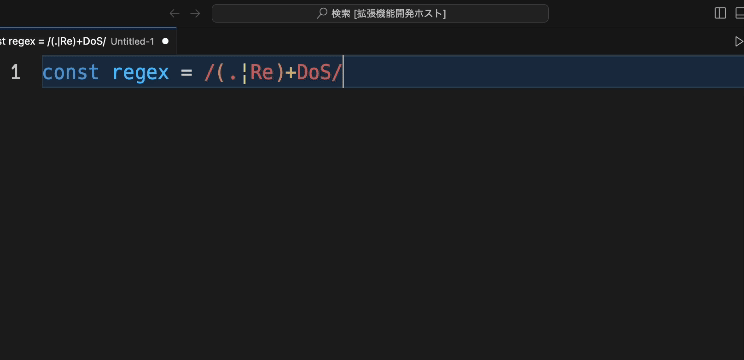

# redos-checker-for-vscode

VSCode extension to detect vulnerable regular expressions

## Usage
With the regular expression cursor selected, do one of the following.

- Run `redos-checker-for-vscode` from the Command Palette (Ctrl+Shift+p)
- Right-click to open the context menu and select `redos-checker-for-vscode`

## Requirements
This extension depends on vulnerability detection engine, [recheck](https://github.com/MakeNowJust-Labo/recheck).

## Author 
[Ran350](https://github.com/Ran350)